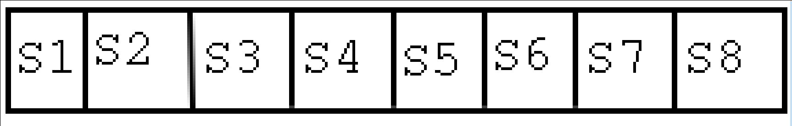

# 序言
* 这是数据结构基础部分总结,之后可能会有专题类型

# 线性表
* 需要注意的是在C语言中没有像C++中的引用传递,即形如`void InsertSort(SqList  &L);`类型的声明在以`.c`为结尾的C语言文件中的话,会报错;所以需要把文件后缀名改为`.cpp`就可以使用了
### 存储方式
* 顺序存储,[Code](https://github.com/HusterYP/DataStructure/blob/master/List/List.cpp)
* 链式存储,分为带头结点和不带头结点的;[Code](https://github.com/HusterYP/DataStructure/blob/master/List/LinkList.cpp)
* 静态链表,仍然是使用数组的形式,如下定义

    typedef struct
    {
        ElemType elem;
        int cur;
    }SLinkList[MAXSIZE];

# 栈
* 表头为栈底，表尾为栈顶，允许操作的为栈顶
* 分为顺序存储和链式存储，静态和动态
* 还需要注意的是top指针的位置，是指向栈顶元素还是指向栈顶元素的前一个空位置

# 队列
* 允许删除的一端为队首,允许插入的一端为队尾
* 采用数组存储时,需要解决假溢出的情况

# 串
## 查找子串
### 一. 暴力搜索
* 若主串长度为N,模式串的长度为M,那么时间复杂度与MN成正比,但是一般情况下,N远大于M,同时在文本匹配中,极端情况也比较少出现,所以一般与N成正比,但是在其他情况下,极端情况还是有可能出现的,比如在进行二进制匹配的时候,此时还是可能出现最坏情况
### 二. KMP
* KMP算法的思想是,当模式串和主串出现不匹配时,主串指针不回朔.将模式串向右滑动尽可能远的距离与主串中当前位置的字符再次进行匹配
* 如下图所示,下图为模式串,如果模式串中匹配到S7时和主串不相配,那么此时主串指针不应该移动,而应该移动模式串指针,假设此时需要移动到Sj,即此时主串应该和Sj继续比较,那么说明模式串中S1--Sj-1部分和S7-j+1--S7-1相匹配;那么对于每一次失配,只需要找出模式串应该移动的位置即可,同时由于模式串相对长度小的多,所以对其自身进行匹配的代价会小得多

* KMP算法改进,一个是对next数组的改进,可以[参考博文](https://blog.csdn.net/v_july_v/article/details/7041827)
* KMP算法除了对next的改进之外,我觉得还可以在匹配到主串末尾的时候改进,假设主串长度n,模式串长度m,那么匹配到主串的末尾m-1个字符之后就没有必要再匹配下去了,因为实际上长度不够,肯定匹配不成功,这种在模式串也比较长的情况下效果较为明显
* KMP的时间复杂度为O(m+n)
### 三. BM算法
* [参考博文](http://www.ruanyifeng.com/blog/2013/05/boyer-moore_string_search_algorithm.html)
* 基本思想是从末尾开始匹配,然后分为`坏字符`和`好后缀`,重新定义二者在出现不匹配的时候,模式串应该后移的位数来简化匹配
* 一般各种文本编辑器的查找功能都采用BM算法,[参考博文](http://www.stoimen.com/blog/2012/04/17/computer-algorithms-boyer-moore-string-search-and-matching/)
### 四. RK算法
* 对于常规的算法都需要将模式串中字符一个一个与主串进行比较,RK算法是利用Hash值来进行一次性的比较

# 排序
### 一. 基数排序
* 基数排序对于存在负数和小数的会存在问题;但是网上一些资料也说,对于负数而言,可以分成两部分(正数和负数)排序,排好后再将负数颠倒与正数合并
